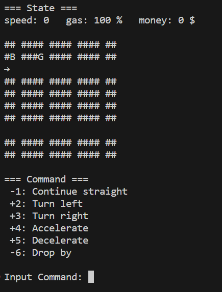

# Drive Adventure Game
コマンドにより自動車を操作するゲーム

## How to setup
以下のレポジトリをクローン
```
https://github.com/toshihironakatani/cpp-01-project-ja

```

main.cppのフォルダに移動し、以下のコマンドによりビルト
```
g++ -std=c++17 -o main *.cpp -fexec-charset=CP932
```

以下のコマンドで実行
```
./main
```


## How to play
### 概要
* コマンドの数字を入力して車両を操作する
* コマンドを入力する毎に車両状態が更新される
* 乗客をピックアップして目的地を目指す

### 表示説明

#### Map
* #: 走行不可領域
* 空白: 走行可能領域
* →: 車両位置と進行方向
* G: ガソリンスタンド
* B: 銀行
* D: 目的地
* P: 乗客

#### State
* speed: 車速
* gas: ガソリン残量
* money: 持ち金
* passenger: 乗客の同乗有無
* count: 操作回数

#### Command
* "+": 選択可能な操作
* "-": 選択不可の操作


## Rule
* "#"に進入するとゲームオーバー
* 右左折するには車速0まで減速する必要がある
* 車両は車速分のマスを移動する
* ガソリン残量は移動マス分減少する
* ガソリン残量が0になったらゲームオーバー
* Landmarkと隣接するマスに停車（speed = 0）し、"Drop by"のコマンドを選択することで立ち寄ることが可能
* ガソリンスタンドでは1% = 1$で持ち金をガソリンに変換して給油できる
* 銀行では立ち寄る毎に10$を取得できる
* 乗客を乗せた状態で目的地に到達するとゲーム成功


## プロジェクトにおける重要な設計やその設計理由
* 現実的な車両運動でない操作は受け付けない
* CarStateという構造体を作成し、車両状態の信号をまとめて管理することで、状態遷移を管理しやすくする
